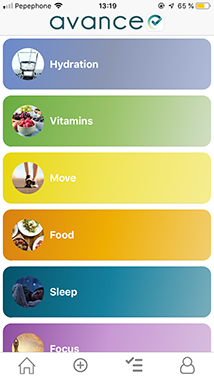
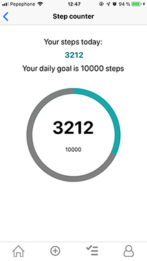
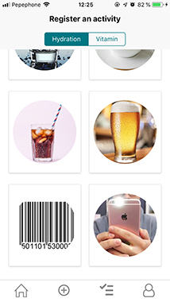
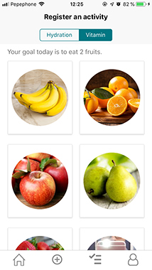
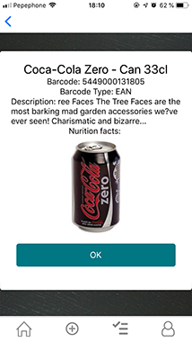
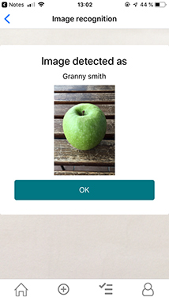
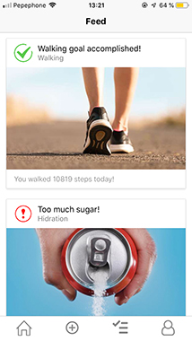

# Avance (Native App)

## Habit builder

This app will help people to create good habits every day. It gives recomendations that the user should follow. The result is displayed in a feed, depending on the user actions.

This was my final project at Ironhack Web Developer bootcamp. I only had 1,5 weeks to build it, so I didn't have time to implement all features I would have liked. For the MVP I focused on three activities, Hidration, Vitamins and Simple Exercise.

The application is built in React Native with a backend using Mongo, Express and Node.js.

## How it works

### Register activities
When a user signs in he/she will be taken to the dashboard where the available activities are displayed. You can get more information about the current activity by clicking on the activity tab. Then you can start registring your activities from the info page or directy from the menu. 

   

Some activities are registrated automatically, for instance the Move activity. There you will see your daily goal and information if you reached it or not. To get this information I used the pedometer available natively in the phone. 

Other activities you have to register manually. You can quickly register what you eat or drink just by clicking on the images or you can choose to scan a product with a barcode. For this project I'm using a free api with some basic information about the product. The idea is that for a real app, a much better (paid) api could be used where I could get all the nutrition information to store in the database. This way detail feedback could be provided to the user about nutrition, vitamins, sugar intake and so on.

   

For other pruducts that don't have a barcode I have also added an image recognition feature. Here you can take a photo of a product/fruit/food and then it is sent to the Google Vision API for recognition and the response will be saved in the database for future user feedback.

### Feedback
Finaly the user will get feedback in the user feed. As soon as a goal is accomplished, it will be displayed in the feed. The feed will also provide the user with negative feedback (warnings). For instance if he/she drinks to much soda or alcohol, the feed will tell the user to try to reduce the suger intake etc.

### Left todo

#### Levels

For this project I only had time to develop one level for the three first activities, but the idea is that when a user complets a goal, he/she will come to the next level that increases the difficulty. This would offer basic gamification which I think would be interesting for many users.

#### Push notifications

To make the user come back to the app it would be nice to implement local or push notification in order to let the user know when there is new information available in the feed or when he/ she has forgotten to register activities for a certain amount of time. This would improve stickyness.

------

## User Stories

- **Signup:** As an anon I can sign up in the platform.

- **Login:** As a user I can login to the platform so that I can register activity and see my progress.

- **Logout:** As a user I can logout from the platform so no one else can use it

- **Onboarding:** As a user I will answer some introduction questions. 

- **User profile** As a user I can edit my profile.

- **Dashboard** As a user I can see the activitys I can work on.

- **Activity Reg** As a user I will be able to registrer what I eat or drink.

- **Activit movement reg**  As a user I want to be able to see how many steps I taken/day.

- **Feedback** As a user I want to get feedback on how I'm doing.

  

# Server
The server is found [here](https://github.com/ansolantz/avance-backend)

## Links

### The app

[Deploy Link (mobile)](https://exp.host/@ansolantz/avance-native)

